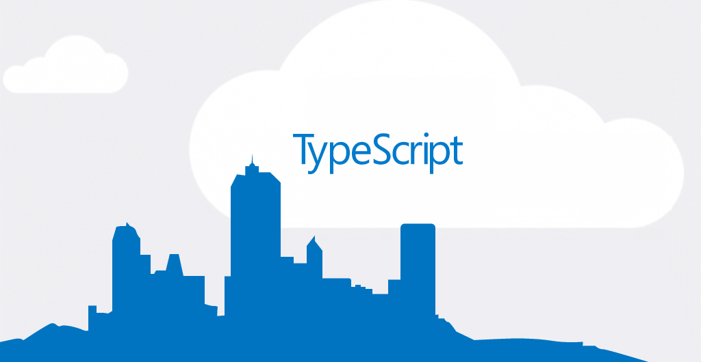

#Getting Started

TypeScript is a compile-to-JS language. All code you write, in TypeScript, will eventually be executed by a JavaScript runtime. This could be a browser or server environment, such as Chrome or Node.js.

> Install Node.js from https://nodejs.org/ <
Install [TypeScript](http://www.typescriptlang.org/#Download) 1.6+ using Node Package Manager command:  
```
$ npm install -g typescript
```
Compiling your code
```
$ tsc main.ts
```	
4. Compiling int real time
```
$ tsc -w main.ts
```	
Create file tsconfig.json
```
$ tsc -init
```	
Compiling int real time
```
$ tsc -w
```	
Run transpiled javascript:
```
$ node server.js
```	


> Install [VSCode](https://code.visualstudio.com/Download)
> Reading and [transpile typescript](http://blogs.msdn.com/b/typescript/archive/2015/04/30/using-typescript-in-visual-studio-code.aspx)
> Run transpiled javascript by running the following command:
```
$ node app
```		
		
##Also Read:
+ https://code.visualstudio.com/Docs/languages/typescript
+ http://tutorialzine.com/2016/07/learn-typescript-in-30-minutes/
